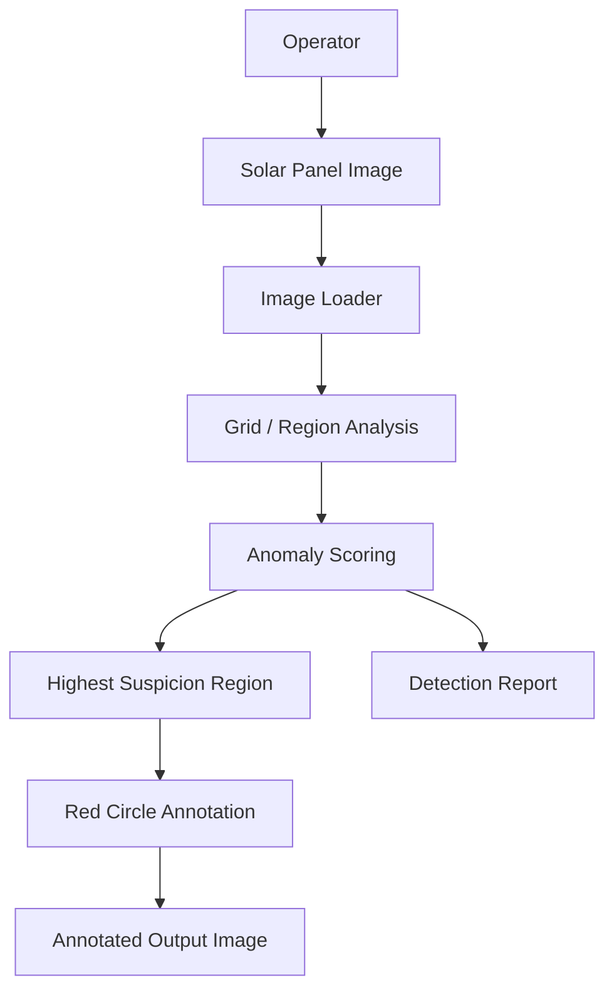

# Architecture

## Data Flow

## Components

| Component | Technology | Responsibility |
|---|---|---|
| Input | PPM image | Provides panel image |
| Image loader | C++ | Reads pixels |
| Region analyzer | C++ | Computes region statistics |
| Detector | C++ | Selects suspicious region |
| Annotator | C++ | Draws red circle |
| Report generator | C++ | Writes detection report |
| Conversational layer | IBM Bob/watsonx (future/integration point) | Explains results in natural language |

## End-to-End Flow
1. User supplies a panel image.
2. The image loader parses the PPM header and pixel data.
3. The detector divides the image into regions.
4. Each region receives an anomaly score.
5. The highest-scoring region is selected.
6. A red circle is drawn around the selected region.
7. The annotated image and report are saved.

## Security and Scalability
The prototype does not require credentials and performs local processing. A deployed version should validate uploads, restrict file sizes, protect credentials, and log model/detection versions. Region analysis can be parallelized for larger images.
