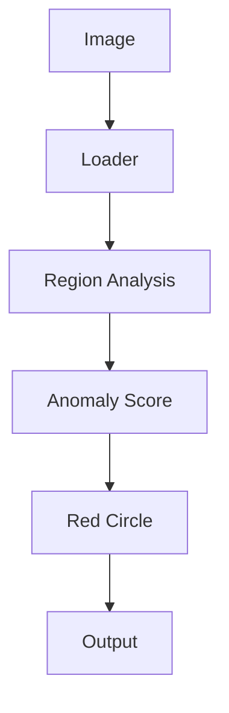

# Solar Monitor — Solar Panel Fault Detection

## Slide 1 — Problem
- Solar-panel abnormalities can be difficult to identify quickly.
- Operators need a clear indication of where to inspect.

## Slide 2 — Solution
- Input a solar-panel image.
- Analyze regions for abnormal pixel intensity.
- Highlight the most suspicious region with a red circle.
- Produce a detection report.

## Slide 3 — Architecture

## Slide 4 — IBM Technology Integration
- IBM Bob can act as the conversational interface around the detector.
- A future watsonx.ai layer can explain anomaly scores and summarize inspection results.
- The local detector remains the deterministic image-processing component.

## Slide 5 — Impact
- Faster first-pass inspection.
- More interpretable results.
- Lightweight deployment.
- Future support for trained models, multiple defects, historical trends, and fleet monitoring.

## Slide 6 — Demo
1. Generate or select a panel image.
2. Run the detector.
3. Show the annotated image.
4. Open the generated report.
